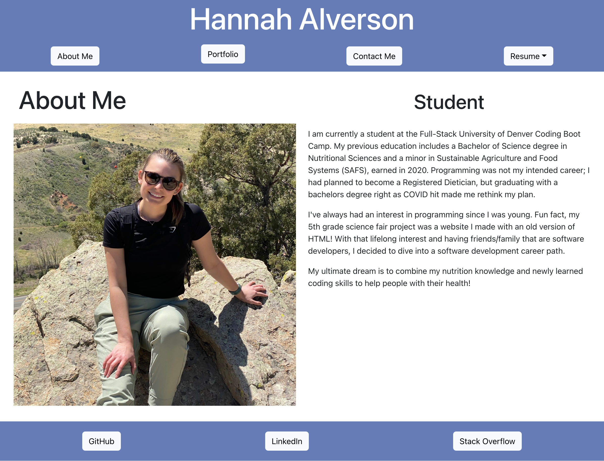
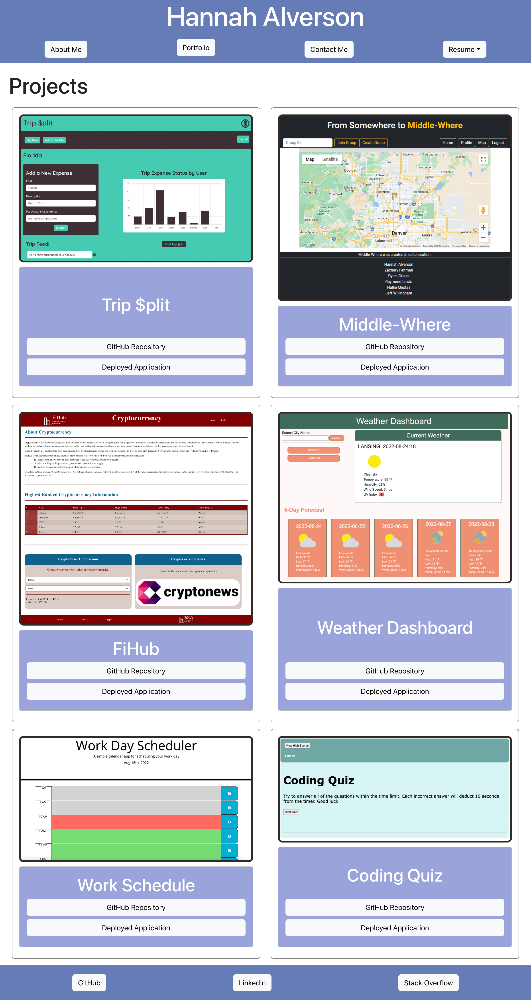
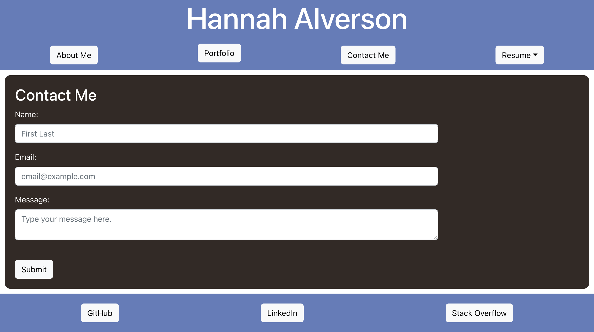

# Hannah Portfolio Made with React: portfolio-react

Module 20 React Challenge: React Portfolio

---

## Description

This portfolio was built to showcase all of the applications that I have created throughout my career. I am a recent graduate of the DU Coding Boot Camp, so I don't have many deployed applications. However, I am consistently working on new projects that will be added as they are completed.

This portfolio was built using react and only showcases the front-end capabilities. My plans for the future is to add back-end functionality, update/ add better designs, and showcase more personal projects completed outside the boot camp.

Tools used to complete this project:

- VS Code
- GitHub
- Node.js
- React
- Bootstrap

## Installation

To install the application:

1. Open the GitHub repository.
2. Click the code dropdown button, select the preferred cloning method, and clone code to device.
3. Open the cloned code in preferred code editor.
4. Install Node.js packages.
5. Run `npm start` to launch the app on localhost port.

## Usage

Here is the current appearance of the portfolio:

### Links

The portfolio is currently deployed through GitHub pages.

[Link](https://alverson98.github.io/portfolio-react/) to deployed application.

## Questions

You may contact me with any questions or concerns through the email provided or my GitHub.

Email: alverson98@yahoo.com

GitHub: https://github.com/alverson98

## Credits

I received guidance and tips from the instructional staff, TA's, and Students from the University of Denver Coding Boot Camp.
